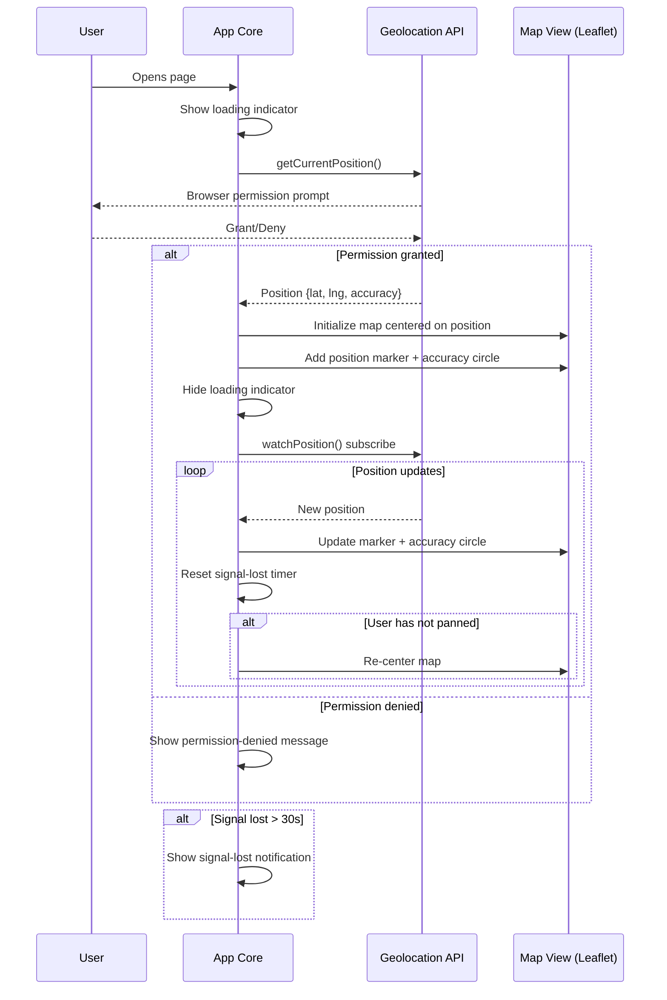

# Design Document: Location Tracker

## Overview

The Location Tracker is a lightweight, single-page web application that displays the user's real-time geographic position on an interactive map. It targets Android mobile browsers as the primary platform, using the browser's Geolocation API for position data and Leaflet.js for map rendering with OpenStreetMap tiles.

The application is built as a vanilla HTML/CSS/JavaScript project with no build step required. This keeps the deployment simple (static file hosting) and the bundle size minimal for mobile networks.

### Key Design Decisions

| Decision | Choice | Rationale |
|---|---|---|
| Map library | Leaflet.js (~42 KB) | Lightweight, mobile-optimized, open-source, no API key required for basic usage with OSM tiles |
| Tile provider | OpenStreetMap | Free, no API key, good global coverage |
| Framework | Vanilla JS (ES modules) | No build step, minimal bundle, sufficient for a single-page app |
| Styling | Plain CSS | No framework overhead; responsive layout via viewport units and media queries |
| Hosting requirement | HTTPS | Required by Geolocation API on all modern browsers |

## Architecture

The application follows a simple event-driven architecture with three layers:

```
┌─────────────────────────────────────────────┐
│                  Browser                     │
│                                              │
│  ┌──────────┐   ┌────────────┐   ┌────────┐ │
│  │ Geolocation│──▶│  App Core  │──▶│  Map   │ │
│  │   API     │   │ (State +   │   │  View  │ │
│  │           │◀──│  Logic)    │◀──│(Leaflet)│ │
│  └──────────┘   └────────────┘   └────────┘ │
│                       │                      │
│                  ┌────▼─────┐                │
│                  │   UI     │                │
│                  │ Overlay  │                │
│                  │(Loading, │                │
│                  │ Errors)  │                │
│                  └──────────┘                │
└─────────────────────────────────────────────┘
```

### Data Flow



## Components and Interfaces

### 1. `index.html` — Entry Point

The single HTML file that loads CSS, sets up the viewport meta tag, and includes the application script.

Responsibilities:
- Viewport meta tag for mobile rendering (`width=device-width, initial-scale=1.0, user-scalable=no`)
- Container `<div>` for the Leaflet map (`#map`)
- Overlay container for loading/error UI (`#overlay`)
- Loads Leaflet CSS/JS from CDN
- Loads application module (`app.js`)

### 2. `app.js` — Application Core

The main module that orchestrates geolocation, map rendering, and UI state.

```typescript
// Conceptual interface (implemented in plain JS)

interface AppState {
  map: L.Map | null;
  marker: L.CircleMarker | null;
  accuracyCircle: L.Circle | null;
  watchId: number | null;
  userHasPanned: boolean;
  signalLostTimerId: number | null;
  isInitialized: boolean;
}

// Public functions
function init(): void;                          // Entry point, called on DOMContentLoaded
function handlePositionSuccess(pos: GeolocationPosition): void;
function handlePositionError(err: GeolocationPositionError): void;
function startWatching(): void;
function stopWatching(): void;
function onPositionUpdate(pos: GeolocationPosition): void;
function resetSignalLostTimer(): void;
```

### 3. `map.js` — Map View Module

Encapsulates all Leaflet interactions.

```typescript
// Conceptual interface
function createMap(containerId: string): L.Map;
function centerMap(map: L.Map, lat: number, lng: number, zoom?: number): void;
function addPositionMarker(map: L.Map, lat: number, lng: number): L.CircleMarker;
function updatePositionMarker(marker: L.CircleMarker, lat: number, lng: number): void;
function addAccuracyCircle(map: L.Map, lat: number, lng: number, radiusMeters: number): L.Circle;
function updateAccuracyCircle(circle: L.Circle, lat: number, lng: number, radiusMeters: number): void;
function onUserPan(map: L.Map, callback: () => void): void;
```

### 4. `ui.js` — UI Overlay Module

Manages the loading indicator, error messages, and signal-lost notification.

```typescript
// Conceptual interface
function showLoading(message: string): void;
function hideLoading(): void;
function showError(message: string): void;
function hideError(): void;
function showSignalLost(): void;
function hideSignalLost(): void;
```

### 5. `geolocation.js` — Geolocation Wrapper Module

Wraps the browser Geolocation API with consistent error handling and configuration.

```typescript
// Conceptual interface
interface GeoOptions {
  enableHighAccuracy: boolean;  // true — prefer GPS on mobile
  timeout: number;              // 10000ms for initial, 15000ms for watch
  maximumAge: number;           // 0 — always fresh position
}

function getCurrentPosition(): Promise<GeolocationPosition>;
function watchPosition(
  onSuccess: (pos: GeolocationPosition) => void,
  onError: (err: GeolocationPositionError) => void
): number;
function clearWatch(watchId: number): void;

// Error code mapping
function getErrorMessage(error: GeolocationPositionError): string;
```

### 6. `styles.css` — Stylesheet

Responsive styles for the map container and overlay elements.

Key layout rules:
- `#map`: `width: 100vw; height: 100vh;` — full viewport on mobile
- `#overlay`: Absolutely positioned over the map, centered content
- Media queries for screens wider than 768px (optional desktop adjustments)
- Touch-action rules to prevent browser gesture conflicts with Leaflet

## Data Models

### Position Data

The application works with the browser's native `GeolocationPosition` object:

```javascript
// From Geolocation API (read-only)
{
  coords: {
    latitude: number,     // -90 to 90
    longitude: number,    // -180 to 180
    accuracy: number,     // meters (radius of 68% confidence)
    altitude: number | null,
    altitudeAccuracy: number | null,
    heading: number | null,
    speed: number | null
  },
  timestamp: number       // DOMTimeStamp (ms since epoch)
}
```

### Application State

```javascript
// Internal state object
{
  map: L.Map | null,              // Leaflet map instance
  marker: L.CircleMarker | null,  // User position marker
  accuracyCircle: L.Circle | null,// Accuracy radius visualization
  watchId: number | null,         // Geolocation watchPosition ID
  userHasPanned: boolean,         // True if user manually panned the map
  signalLostTimerId: number | null, // setTimeout ID for 30s signal-lost check
  isInitialized: boolean          // True after first successful position + map render
}
```

### Error Message Mapping

```javascript
// GeolocationPositionError.code → user-facing message
{
  1: "Location permission was denied. Please enable location access in your browser settings to use this app.",
  2: "Your location could not be determined. Please ensure location services are enabled on your device.",
  3: "The location request timed out. Please check your connection and try again."
}
```

### Constants

```javascript
{
  INITIAL_ZOOM: 16,                    // ~500m radius neighborhood view
  SIGNAL_LOST_TIMEOUT_MS: 30000,       // 30 seconds
  GEO_OPTIONS_INITIAL: {
    enableHighAccuracy: true,
    timeout: 10000,
    maximumAge: 0
  },
  GEO_OPTIONS_WATCH: {
    enableHighAccuracy: true,
    timeout: 15000,
    maximumAge: 0
  },
  MARKER_RADIUS: 8,                    // pixels
  MARKER_COLOR: '#4285F4',             // Google Maps-style blue
  ACCURACY_CIRCLE_COLOR: '#4285F4',
  ACCURACY_CIRCLE_OPACITY: 0.15
}
```

